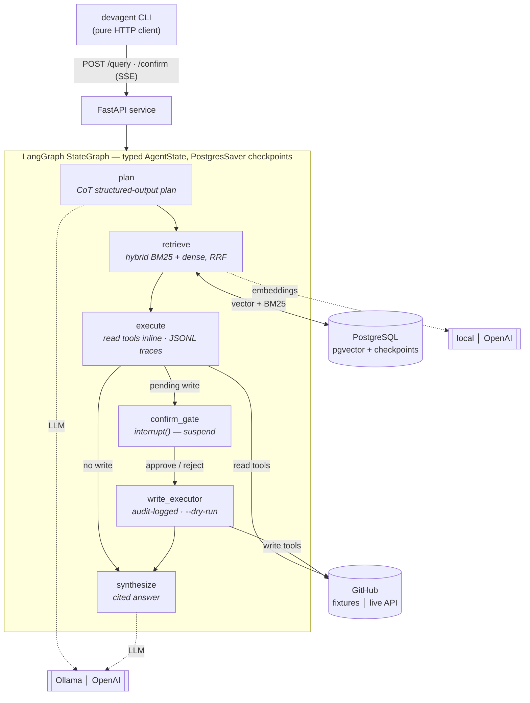

# Developer Productivity Agent Platform

[](https://github.com/sananm/dev-productivity-agent/actions/workflows/ci.yml)


A multi-agent system that turns natural-language developer queries into executed
GitHub SDLC actions. A **planner** decomposes a query into a multi-step plan, a
**retriever** pulls context from a hybrid RAG index (code, issues/PRs, docs,
commits), and an **executor** calls GitHub tools — synthesizing a source-cited
answer or performing a confirmation-gated write action. A **benchmarking and
evaluation harness** measures the agent's task-completion, tool-call accuracy,
and hallucination rate across 200+ test cases.

The platform runs **fully offline by default** — local Ollama LLM, local
sentence-transformer embeddings, and bundled GitHub fixtures — with no API keys
and no network. Every external dependency is a pluggable backend.

---

## Demo

```console
$ devagent ask "How does requests handle HTTP redirects?"
repo: psf/requests  ·  api: http://localhost:8000

╭───────────────────────────────── Plan ─────────────────────────────────╮
│  0. [retrieve]  Gather redirect-handling code, docs, and history.       │
│  1. [answer]    Synthesize the final answer.                            │
╰─────────────────────────────────────────────────────────────────────────╯
· retrieved 9 context chunks

──────────────────────────────── Answer ─────────────────────────────────
requests handles redirects in Session.resolve_redirects, which iterates over
redirect responses, rebuilds each request, and enforces a max-redirect limit
(src/requests/sessions.py:133-234). Location redirection is on by default for
all verbs except HEAD; Response.history records the chain (quickstart.rst) ...

╭──────────────────────────────── Sources ────────────────────────────────╮
│ src/requests/sessions.py:133-234   docs/user/quickstart.rst   #6660      │
╰─────────────────────────────────────────────────────────────────────────╯
```

A write request (`devagent ask "Open an issue about timeout docs"`) instead
suspends at a confirmation gate showing the exact issue to be created, and only
calls GitHub after an explicit `y/N`.

---

## Headline engineering

| Story | Where |
|---|---|
| **Multi-agent orchestration** — typed LangGraph `StateGraph`: planner → retriever → executor → synthesizer, every boundary a Pydantic `AgentState`, PostgresSaver checkpointing, `interrupt()`-based human-in-the-loop write gate, per-agent circuit breakers | `devagent/agents/` |
| **Hybrid RAG** — Okapi BM25 + HNSW dense retrieval fused with Reciprocal Rank Fusion, heuristic source routing, freshness fallback; gated at **Hit Rate@5 ≥ 0.75** before agents may use it (currently **0.90**) | `devagent/rag/` |
| **Eval harness** — 204 cases (25 hand-written golden + 179 generated from real repo entities), 3 metrics (tool-call accuracy, task completion, faithfulness), mocked writes, determinism gate, prompt-version A/B comparison | `eval/` |

---

## Architecture



| Node | Role |
|---|---|
| **plan** | planner LLM, CoT structured output, tool-name inference, ≤3 retries |
| **retrieve** | hybrid BM25 + dense retrieval, RRF fusion, source routing, repo scoping |
| **execute** | read tools run inline (JSONL traces); write tools drafted + suspended |
| **confirm_gate** | `interrupt()` — graph checkpoints to Postgres, waits for `POST /confirm` |
| **write_executor** | audit-logged write; honours `--dry-run`; ≤5 tool steps |
| **synthesize** | source-cited answer grounded only in retrieved + tool context |

### Pluggable backends

| Concern | Default (offline) | Alternative |
|---|---|---|
| LLM | local Ollama (`qwen2.5:7b-instruct`) | `LLM_BACKEND=openai`, or `mock` |
| Embeddings | local `BAAI/bge-small-en-v1.5` (384-dim) | `EMBEDDING_BACKEND=openai` |
| GitHub | bundled JSON fixtures via `FakeGitHubClient` | `GITHUB_MODE=live` (needs `GITHUB_TOKEN`) |
| Eval judge | the agent's LLM | `EVAL_JUDGE_MODEL=<larger model>` or OpenAI |

Switch any backend via `.env` — no code changes.

---

## Quick start

Prerequisites: Docker, [Ollama](https://ollama.com)
(`ollama pull qwen2.5:7b-instruct`), and — for local dev — Python 3.12 +
[`uv`](https://docs.astral.sh/uv/).

### Fastest: one command

```bash
ollama pull qwen2.5:7b-instruct        # the only manual prerequisite
docker compose up                      # Postgres + API; auto-migrates, seeds, indexes
# ... wait for "[entrypoint] starting API on :8000", then:
curl -N -X POST localhost:8000/query -H 'content-type: application/json' \
  -d '{"query":"How does requests handle HTTP redirects?"}'
```

`docker compose up` builds the API image, waits for Postgres, applies the schema,
seeds the eval cases, indexes the default repo, and serves — no other setup. The
local CLI below is optional sugar over the same API.

### Local dev (CLI + hot iteration)

```bash
# 1. environment
uv venv --python 3.12 .venv && source .venv/bin/activate
uv pip install -e ".[eval]"
cp .env.example .env                 # defaults work offline as-is

# 2. infrastructure
docker compose up -d                 # PostgreSQL + pgvector
devagent migrate                     # schema + LangGraph checkpoint tables

# 3. data
devagent seed-eval                   # 25 golden eval cases
devagent eval generate               # expand to 200+ cases
devagent index psf/requests          # ingest code/docs/issues/commits -> pgvector

# 4. quality gate
devagent validate-rag                # Hit Rate@5 must be >= 0.75

# 5. run the agent
uvicorn devagent.api.main:app &       # start the API
devagent ask "How does requests handle HTTP redirects?"
devagent ask "Open an issue about better timeout docs" --dry-run
```

---

## Usage

```bash
devagent ask "<query>"                # plan panel + streamed, cited answer
devagent ask "<query>" --verbose      # also show planner reasoning + tool I/O
devagent ask "<query>" --dry-run      # show write actions without executing
devagent ask "<query>" --repo owner/name
devagent refresh issue                # re-index one source type on demand
devagent eval run                     # eval sample (fast, CI-friendly)
devagent eval run --full              # all 200+ cases
devagent eval run --compare v1 v2     # A/B two prompt versions, metric deltas
devagent health                       # API + active backend status
```

Target repo and API URL resolve from a `.devagent.yml` (see `.devagent.yml.example`),
overridable per-command with flags.

### Write actions are confirmation-gated

A query that proposes a GitHub write (create issue, comment on PR) suspends the
graph at the confirmation gate. The CLI shows a human-readable preview
(repo, action, target, body) and requires an explicit `y/N`; only then does
`POST /confirm` resume the graph and fire the write. Every write transition —
proposed / confirmed / rejected / executed / dry_run — is recorded in the
append-only `audit_log` table.

---

## Evaluation harness

204 cases across four categories (code Q&A, issue triage, cross-source
investigation, action). 25 are hand-written golden cases; `eval/generate.py`
templates the other 179 over real fixture entities so every case has a checkable
ground truth.

```bash
devagent eval run            # deterministic stratified sample
devagent eval run --full     # all 204 cases
RUN_SLOW=1 pytest eval/      # includes the 3x determinism gate
```

Three metrics per case:
- **tool_correctness** — deterministic set comparison of called vs expected
  tools. This RAG-first agent answers read queries from the index (no tools) and
  uses tools only for confirmation-gated writes.
- **task_completion** — DeepEval LLM-judged.
- **faithfulness** — DeepEval `FaithfulnessMetric` (1 − hallucination rate),
  checked against retrieved context + tool/write results.

Writes are mocked during eval — no run mutates GitHub. Sample-run scores (the
agent runs on the local 7B model in both columns; only the judge changes):

| metric | 7B judge | 14B judge |
|---|---|---|
| tool-correctness (deterministic) | 0.92 | 0.92 |
| task completion | 0.86 | 0.77 |
| faithfulness (1 − hallucination) | 0.44 | **0.91** |

The deterministic metric is stable; the LLM-judged metrics are **judge-bound** —
a 7B model is a weak faithfulness judge (it mis-flags correct, grounded
statements), so faithfulness reads artificially low. Swapping in a 14B judge
(`EVAL_JUDGE_MODEL=qwen2.5:14b-instruct`) lifts faithfulness to 0.91 and is
stricter on task completion. Use `LLM_BACKEND=openai` for production-grade
judging. This is exactly why the judge is a separate, swappable backend.

### Prompt engineering loop

Prompts are versioned (`devagent/prompts/v1/`, `v2/`). The framework makes
iteration measurable:

```bash
devagent eval run --compare v1 v2    # same cases, both prompt sets, delta table
```

---

## Observability

With `LANGFUSE_PUBLIC_KEY` / `LANGFUSE_SECRET_KEY` set, every agent node and LLM
call is traced as a span in self-hosted Langfuse:

```bash
docker compose --profile langfuse up -d    # Langfuse at http://localhost:3000
```

Tracing is purely additive — absent keys, the agent runs untraced.

---

## Project structure

```
devagent/
  config.py            pluggable-backend settings
  llm.py               LLM provider (ollama | openai | mock)
  embeddings.py        embedding provider (local | openai)
  audit.py             append-only write audit log
  db/                  pgvector schema, migration, deferred HNSW index
  ingestion/           GitHub client + FakeGitHubClient, fetchers, chunkers, pipeline
  tools/               MCP-style declarative tool registry (read + write)
  rag/                 corpus access, hybrid retriever, Hit Rate@5 gate
  agents/              AgentState, planner, retriever, executor, write gate, synthesizer, graph
  prompts/             versioned prompt sets (v1, v2) + loader
  api/                 FastAPI service (SSE /query, /confirm, /health)
  cli/                 Typer CLI — pure HTTP client
  observability/       Langfuse tracing setup
eval/                  golden cases, generator, harness, judge, runner, pytest
fixtures/              bundled psf/requests snapshot (offline GitHub backend)
scripts/build_fixtures.py   regenerate fixtures from a git clone (no token needed)
```

---

## AWS deployment path

The platform ships dockerized and is designed to lift onto AWS without code
changes — every external dependency is already a network service or a pluggable
backend:

- **Database** — point `DATABASE_URL` at **Amazon RDS for PostgreSQL** with the
  `pgvector` extension enabled (or Aurora PostgreSQL). The schema migration and
  deferred-HNSW step run unchanged.
- **API** — build the `Dockerfile` image, push to **ECR**, run on **ECS Fargate**
  (or EKS) behind an Application Load Balancer. The service is stateless; all
  state lives in Postgres via PostgresSaver.
- **LLM + embeddings** — set `LLM_BACKEND=openai` / `EMBEDDING_BACKEND=openai`,
  or front a self-hosted model on an EC2 GPU instance / **Amazon Bedrock** by
  adding a backend in `devagent/llm.py` (the provider interface is the only
  touch point).
- **GitHub** — set `GITHUB_MODE=live` with a `GITHUB_TOKEN` in **AWS Secrets
  Manager**, injected as an environment variable into the task definition.
- **Observability** — run Langfuse on ECS, or swap the callback in
  `observability/langfuse_setup.py` for CloudWatch.
- **Eval** — the harness is a container entrypoint; run it as a scheduled
  **ECS task** or CI job and persist `eval_results` to the same RDS instance.

Live AWS hosting is documented rather than provisioned — the dockerized stack is
the runnable showcase; the path above is the production lift.

---

## Tech stack

Python 3.12 · LangGraph · LangChain · LlamaIndex · FastAPI · PostgreSQL + pgvector ·
Ollama / OpenAI · Typer + Rich · DeepEval · Langfuse · Docker · `uv`.
